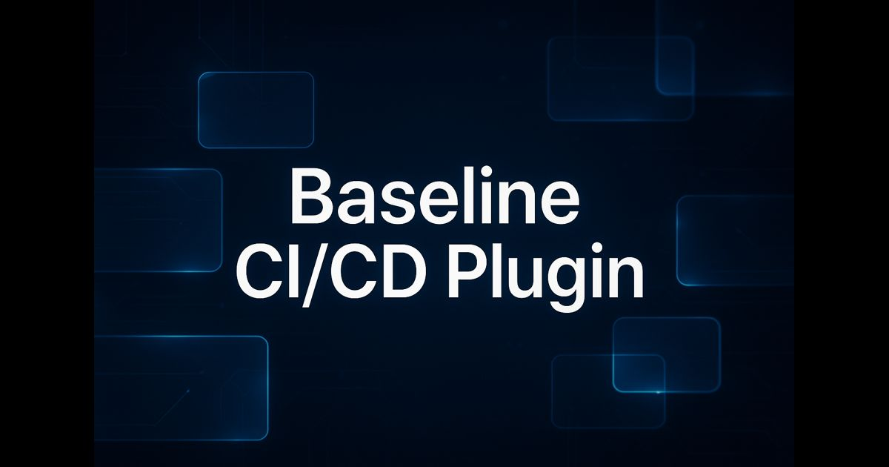

# Baseline CI/CD Plugin



A fast, CI-friendly command‑line tool that scans your project’s HTML/CSS/JS/TS and reports where you’re using modern web features that may or may not be covered by Baseline support. It also performs lightweight dependency-space checks that can mask or complicate Baseline analysis.

Highlights
- Scans source files for features and classifies them using the web-features registry
- Clear text output plus JSON report for CI artifacts; HTML placeholder writer
- Configurable fail policy: warn by default, or fail builds when incompatible features are found
- Powerful include/exclude globs and target path selection
- Dependency checks that complement, not replace, security tools:
  - Polyfills/shims/transpiler packages that can mask native support
  - Multiple build tools detected (possible config conflicts)
  - Both Bootstrap and Tailwind detected (CSS conflicts/bloat risk)

Requirements
- Node.js 18+

Installation (local dev)
- From the project root:
  ```powershell path=null start=null
  npm install
  ```

Quick start
- Scan the current directory:
  ```powershell path=null start=null
  npm start
  ```
- Or explicitly run the CLI:
  ```powershell path=null start=null
  node bin/baseline-check.js
  ```
- Scan specific paths:
  ```powershell path=null start=null
  node bin/baseline-check.js src public/index.html
  ```

CLI usage
- General form:
  ```powershell path=null start=null
  node bin/baseline-check.js [targets...] [options]
  ```
- Options you can pass:
  - -c, --config <path>  Path to .baselineci.json (default: .baselineci.json)
  - --report <format>    Report format: text | json | html
  - --mode <mode>        Fail behavior: fail | warn
  - -o, --output <path>  Output path for report (json/html)
  - --include <globs...> Override include globs
  - --exclude <globs...> Override exclude globs
  - --deps <mode>        Dependency checks: on | off
  - --disable-deps <rules...> Disable specific dependency rules: polyfills, build-tools, css-frameworks

Examples
- Fail CI if a non‑Baseline feature is found:
  ```powershell path=null start=null
  node bin/baseline-check.js --mode fail
  ```
- Write a JSON report to a custom path:
  ```powershell path=null start=null
  node bin/baseline-check.js --report json --output artifacts/baseline.json
  ```
- Limit what gets scanned:
  ```powershell path=null start=null
  node bin/baseline-check.js --include "src/**/*.js" "src/**/*.css" --exclude "dist/**" "node_modules/**"
  ```
- Disable all dependency checks:
  ```powershell path=null start=null
  node bin/baseline-check.js --deps off
  ```
- Keep dependency checks on, but disable specific rules:
  ```powershell path=null start=null
  node bin/baseline-check.js --disable-deps polyfills css-frameworks
  ```

Configuration (.baselineci.json)
- You can place a .baselineci.json in your project root to set defaults. CLI flags always override config.
  ```json path=null start=null
  {
    "mode": "warn",
    "report": { "format": "text", "output": null },
    "deps": {
      "enabled": true,
      "disableRules": ["polyfills", "build-tools", "css-frameworks"]
    },
    "include": ["**/*.js", "**/*.ts", "**/*.css", "**/*.html"],
    "exclude": ["node_modules/**", "dist/**", "build/**", ".git/**"]
  }
  ```

What the dependency checks look for
- Polyfills/shims/transpilers: core-js, core-js-pure, babel-polyfill, @babel/polyfill, es5/6/7-shim, @es-shims/* → these can mask native support and hide compatibility issues when you rely on Baseline.
- Multiple build tools: detects 2+ among webpack, vite, rollup, parcel, esbuild, gulp, grunt, snowpack → not inherently wrong, but often a source of conflicts.
- CSS frameworks: flags when both Bootstrap and Tailwind are present → can cause conflicting resets/utilities and increase bundle size.

Reports and exit codes
- Text report: printed to stdout by default
- JSON report: --report json writes baseline-report.json (or use --output)
- HTML report: currently a placeholder page (use JSON for structured CI artifacts)
- Exit code policy:
  - warn (default): process exits 0 regardless of findings
  - fail: process exits 1 if any non‑Baseline features are detected

Make it available globally (optional for local dev)
- Link the CLI so the baseline-check command is available everywhere on your machine:
  ```powershell path=null start=null
  npm link
  baseline-check --help
  ```

CI integration (example)
- Minimal GitHub Actions snippet:
  ```yaml path=null start=null
  name: Baseline
  on: [push, pull_request]
  jobs:
    scan:
      runs-on: ubuntu-latest
      steps:
        - uses: actions/checkout@v4
        - uses: actions/setup-node@v4
          with:
            node-version: 20
        - run: npm ci
        - run: node bin/baseline-check.js --mode fail --report json --output baseline-report.json
        - name: Upload report
          uses: actions/upload-artifact@v4
          with:
            name: baseline-report
            path: baseline-report.json
  ```

Limitations
- The HTML report is a placeholder (use JSON for CI).
- The tool complements, not replaces, npm audit/Dependabot—its goal is Baseline-focused compatibility checks.


License
- MIT

